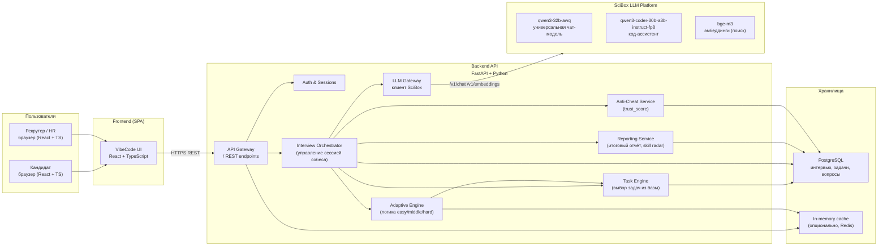
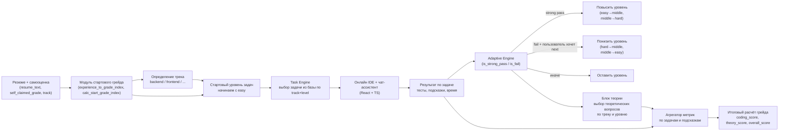

# VibeCode — Чек-поинт 1  
## Архитектура, интеграция со SciBox, стратегия LLM и адаптивность

Этот файл описывает то, что нужно показать на Чек-поинте 1:

1. Архитектурное решение и интеграция со **SciBox**.  
2. Стратегия работы с **LLM** (какие модели, для каких задач, как вызываем).  
3. Проектирование **системы адаптивности** (как мы двигаем кандидата по уровням сложности).

---

## 1. Общая архитектура платформы

### 1.1. Высокоуровневая схема



### 1.2. Кратко по ролям модулей

- **Frontend (React + TS)**  
  - онлайн-IDE, чат-ассистент, подсказки, метрики по задачам;  
  - UI для рекрутера: просмотр отчёта, доверия (trust_score), таймлайна.

- **FastAPI Backend**  
  - REST API для фронта;  
  - orchestration собеседования (`Interview Orchestrator`);  
  - `Adaptive Engine` — решает, какую задачу дать следующей;  
  - `Task Engine` — достаёт задачу из базы по треку и уровню;  
  - `LLM Gateway` — обёртка над SciBox API (OpenAI-совместимый клиент);  
  - `Anti-Cheat` — агрегирует события и считает `trust_score`;  
  - `Reporting` — агрегирует метрики, считает итоговый грейд и готовит JSON для LLM-отчёта.

- **PostgreSQL**  
  - кандидаты, интервью, результаты задач;  
  - база задач (easy/middle/hard по трекам);  
  - база теоретических вопросов;  
  - логи античита (по необходимости).

- **SciBox LLM**  
  - только как **LLM-сервис**, модели одинаковые у всех команд;  
  - наша сила — в **архитектуре, промптах и адаптивности**, а не в тренировке модели.

---

## 2. Интеграция со SciBox и стратегия LLM

### 2.1. Техническая интеграция

- Используем официальный OpenAI-совместимый клиент:

```python
from openai import OpenAI

client = OpenAI(
    api_key=SCIBOX_API_KEY,                  # токен из окружения
    base_url="https://llm.t1v.scibox.tech/v1"
)
```

- `LLM Gateway` — это один модуль, через который ходят все вызовы LLM:

```python
def call_chat(model: str, messages: list[dict], **kwargs) -> str:
    return client.chat.completions.create(
        model=model,
        messages=messages,
        **kwargs
    ).choices[0].message.content
```

- Соблюдаем ограничения по RPS:
  - `qwen3-32b-awq` — 2 RPS на команду;
  - `qwen3-coder-30b-a3b` — 2 RPS;
  - `bge-m3` — 7 RPS.
  → Поэтому LLM Gateway может держать простую **очередь/ограничитель** параллельности.

### 2.2. Стратегия по моделям

Таблица «какую модель, для чего используем»:

| Задача                                   | Модель                         | Комментарий                                     |
|------------------------------------------|--------------------------------|-------------------------------------------------|
| Парсинг резюме, определение стажа/треков | `qwen3-32b-awq`                | строгий JSON, system-полис `/no_think`         |
| Интервьюер в чате                        | `qwen3-32b-awq`                | диалог, уточнения по задаче                     |
| Подсказки (Hint Economy)                 | `qwen3-32b-awq`                | soft/medium/hard hints по жёсткому формату      |
| Итоговый отчёт (summary + рекомендации)  | `qwen3-32b-awq`                | LLM только красиво оформляет уже посчитанные метрики |
| Bug Hunter (генерация тестов)            | `qwen3-coder-30b-a3b`          | анализ кода, поиск граничных кейсов             |
| AI-likeness (похожесть на LLM-код)       | `qwen3-coder-30b-a3b`          | оценка, насколько код выглядит как сгенерированный |
| (опционально) поиск по базе знаний       | `bge-m3`                       | эмбеддинги для семантического поиска            |

### 2.3. Стратегия промптинга

- Каждой задаче — **свой system-промпт** (описано в `PROMPTS_VibeCode.md`):
  - CV-анализ,
  - генерация подсказок,
  - Bug Hunter,
  - Explanation Check,
  - финальный отчёт.
- Формат ответов:
  - строго **JSON**, без Markdown;
  - ключи на английском, текст на русском.
- `/no_think` в `system`, чтобы:
  - отключить длинный reasoning,
  - ускорить ответы,
  - снизить шум.

---

## 3. Проектирование системы адаптивности

### 3.1. Общая схема адаптивного цикла



### 3.2. Логика перехода по уровням

- У нас есть уровни задач: `easy`, `middle`, `hard`.
- Всегда начинаем с `easy`.
- После каждой задачи считаем `TaskResult`:
  - покрытие видимых/скрытых тестов;
  - использованные подсказки;
  - время.

**Правила:**

- `strong pass` → уровень **повышаем**:
  - easy → middle
  - middle → hard

- `fail` + кандидат жмёт «следующая задача» → уровень **понижаем**:
  - hard → middle
  - middle → easy

- иначе → остаёмся на текущем уровне, можно сделать ещё одну задачу того же типа.

Это реализовано в `Adaptive Engine` через функции:

- `is_strong_pass(result)`,
- `is_fail(result)`,
- `update_level_after_task(current_level, result, user_clicked_next)`.

### 3.3. Связь адаптивности и финального грейда

- Все `TaskResult` и ответы на теорию складываются в агрегатор метрик.
- Считаем:
  - `coding_score` с разными весами для easy/middle/hard;
  - `theory_score`;
  - `overall_score = 0.7 * coding + 0.3 * theory`.
- По `overall_score` определяем `perf_grade_index` (performance grade).
- Финальный грейд = комбинация:
  - performance,
  - опыт (`exp_index`),
  - самооценка (`self_index`).

Это подробно описано в `README_VibeCode_logic.md`, но для чек-поинта 1 важно показать, что:

- **адаптивность** не только меняет сложность задач сейчас,
- но и даёт богатый набор метрик, из которых потом строится **честный итоговый грейд**.

---

## 4. Что можно проговорить голосом на чек-поинте

1. **Архитектура**  
   - У нас классическая фронт–бек–БД архитектура, плюс внешний LLM-сервис SciBox.  
   - Все интеграции с LLM вынесены в отдельный модуль `LLM Gateway`, что позволяет:
     - централизованно контролировать RPS и токен,
     - быстро менять промпты и модели.

2. **Стратегия LLM**  
   - Модели у всех участников одинаковые, сила — в промптах и оркестрации.  
   - Мы разделили задачи по ролям:
     - универсальная модель — для диалогов, резюме, отчётов и подсказок;
     - кодовая — для Bug Hunter, AI-likeness и анализа кода;
     - эмбеддинги — для последующего расширения (поиск по задачам/базе знаний).

3. **Адаптивность**  
   - Мы не просто даём «рандомные задачи», а строим адаптивный маршрут:
     - стартовый грейд по резюме и самооценке,
     - динамическое повышение/понижение сложности,
     - теория привязывается к тем задачам, которые кандидат реально решал,
     - финальный грейд — результат и опыта, и текущего перформанса.

Этот документ можно положить в репу как `CHECKPOINT_1_ARCH.md` и использовать как основу для презентации на чек-поинте.
